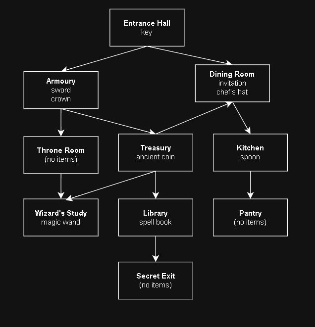

# Castle of Illusions
**A Text-Based Adventure Game**

## Description
*Castle of Illusions* is a text-based adventure game built in Python that demonstrates key LFA (Logic and Fundamentals of Algorithms) concepts. Explore a mysterious castle, collect essential items, and solve challenges to find the secret exit and escape!

> **OBSERVATION:** This game is keysensitive!

## Game Mechanics
- **Navigation:** Move between rooms using the command `go [room name]`.
- **Exploration:** Use `look` to view the room description and see adjacent rooms.
- **Inventory:** Check your items with `inventory`, pick up items with `take [item]`, and drop them with `drop [item]`.
- **Progression:** Certain rooms require specific items to enter, adding a layer of strategy to your adventure.

## Game Map
You can use the following game map for easier understanding of the castle and where all the items are. The `look` command does not show the items in the room.

